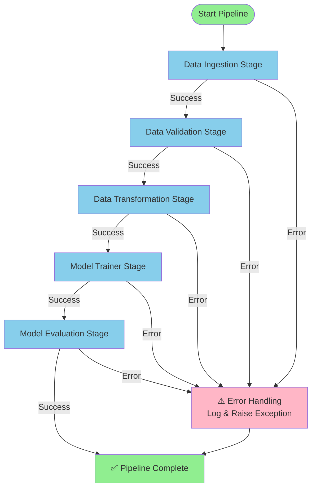

# End-to-End Data Science Pipeline

A complete machine learning pipeline for predicting wine quality using the Wine Quality dataset. This project demonstrates best practices in data science with a clean folder structure, modular design, and integrated experiment tracking.

## 📋 Project Overview

This pipeline automates the entire ML workflow from data ingestion to model evaluation. It uses **ElasticNet regression** to predict wine quality scores and tracks all experiments with **MLflow** on **DagsHub**.

### Dataset
- **Wine Quality Dataset** (red wine): 1,599 samples with 11 physicochemical features
- **Target**: Wine quality (ratings from 3–8)
- **Source**: Automatically downloaded from GitHub during pipeline execution

## 🛠️ Tech Stack

- **Python 3.10+**
- **scikit-learn**: ElasticNet model, preprocessing
- **MLflow**: Experiment tracking & model registry (hosted on DagsHub)
- **Flask**: Web framework
- **HTML/CSS**: Simple web UI for predictions
- **YAML**: Configuration management

## 📁 Project Structure

```
basic_project/
├── config/
│   ├── config.yaml          # Data paths, model params
│   ├── schema.yaml          # Dataset schema validation
│   └── params.yaml          # Model hyperparameters
├── src/datascience/
│   ├── components/          # Modular pipeline stages
│   │   ├── data_ingestion.py
│   │   ├── data_validation.py
│   │   ├── data_transformation.py
│   │   ├── model_trainer.py
│   │   └── model_evaluation.py
│   ├── pipeline/            # Pipeline orchestrators
│   ├── config/              # Configuration manager
│   ├── entity/              # Data classes
│   ├── utils/               # Helpers (YAML, logging)
│   └── __init__.py
├── artifacts/               # Generated outputs (data, models, metrics)
├── main.py                  # Pipeline entry point
├── requirements.txt         # Dependencies
└── README.md
```

## 🔄 ML Pipeline Stages

1. **Data Ingestion** — Downloads & extracts wine quality dataset
2. **Data Validation** — Validates schema consistency
3. **Data Transformation** — Feature preprocessing & train/test split
4. **Model Trainer** — Trains ElasticNet regression model
5. **Model Evaluation** — Computes metrics (RMSE, MAE, R²) and logs to MLflow

### Pipeline Flow Diagram



## 🚀 Quick Start

### Prerequisites
- Python 3.10+
- Conda or venv

### Installation

```bash
# Install dependencies
pip install -r requirements.txt

# Set MLflow credentials (optional, for DagsHub integration)
export MLFLOW_TRACKING_URI="your_mlflow_tracking_url"
export MLFLOW_TRACKING_USERNAME="your_dagshub_username"
export MLFLOW_TRACKING_PASSWORD="your_dagshub_token"
```

### Run Full Pipeline

```bash
# Execute all stages (ingestion → evaluation)
python main.py
```

### Run Individual Stages

Edit `main.py` to comment/uncomment pipeline stages as needed.

## 📊 Experiment Tracking

All model runs are logged to **MLflow** including:
- Model hyperparameters (alpha, l1_ratio)
- Evaluation metrics (RMSE, MAE, R²)
- Trained model artifacts

## 🌐 Web UI (Optional)

A Flask app with simple HTML interface for predictions is available in the `app/` directory.

## 📝 Configuration

Update pipeline behavior by editing:
- `config/config.yaml` — Data paths, artifact locations
- `config/params.yaml` — Model hyperparameters (alpha, l1_ratio)
- `config/schema.yaml` — Expected dataset columns

## 📦 Key Dependencies

- scikit-learn
- pandas
- numpy
- mlflow
- flask
- pyyaml

See `requirements.txt` for complete list.